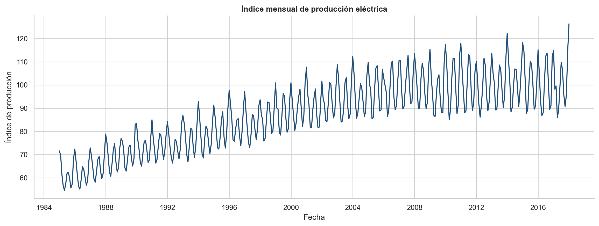
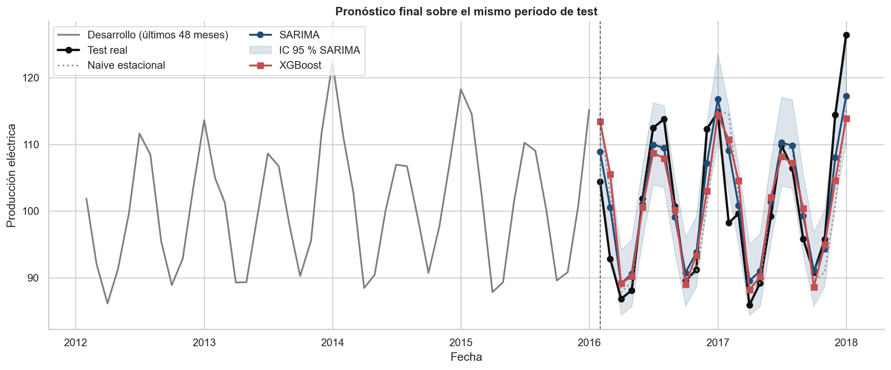
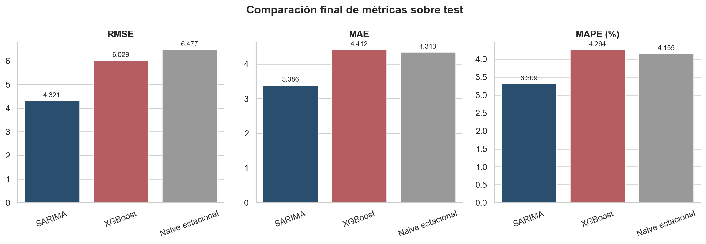
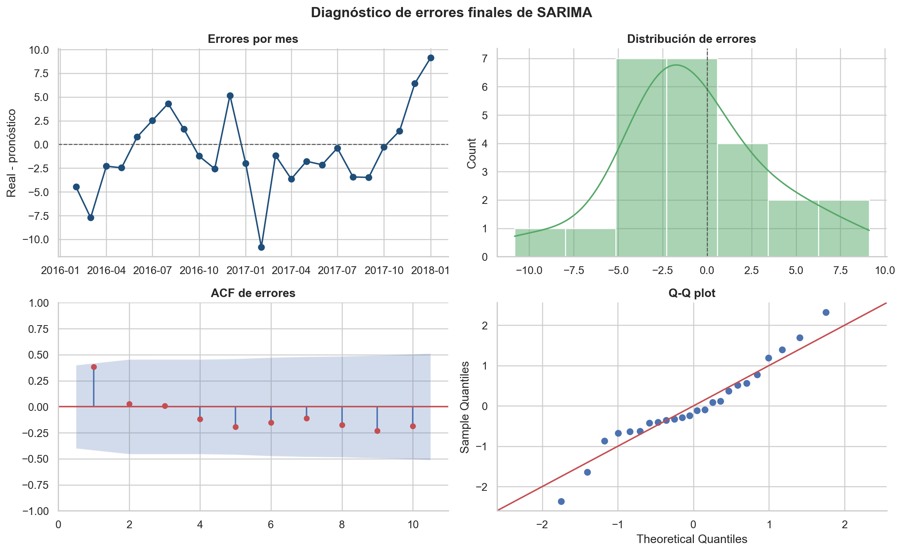

# Forecasting de producción eléctrica mensual

**Autor:** Juan Daniel Barboza  
**Materia:** Series Temporales  
**Proyecto final:** comparación de un modelo estadístico y un modelo de Machine Learning

## Descripción del problema

El objetivo es pronosticar el índice mensual de producción eléctrica a partir de su historial. Este problema permite anticipar la evolución de una serie energética con tendencia y estacionalidad anual, y comparar si una representación estadística explícita de esas componentes supera a un enfoque supervisado de Machine Learning.

Se implementaron dos modelos de categorías diferentes:

- **SARIMA**, modelo estadístico para series con dependencia temporal y estacionalidad.
- **XGBoost**, modelo de Machine Learning entrenado con rezagos, estadísticas móviles y variables de calendario.

También se utilizó un **naive estacional** como referencia: para cada mes repite el valor observado 12 meses antes.

## Dataset

Se utilizó `data/Electric_Production.csv`, perteneciente al conjunto público [Time Series Datasets de Kaggle](https://www.kaggle.com/datasets/shenba/time-series-datasets). La serie equivalente puede consultarse en [FRED, código IPG2211A2N](https://fred.stlouisfed.org/series/IPG2211A2N).

| Característica | Valor |
|---|---:|
| Frecuencia | Mensual |
| Período | Enero de 1985 a enero de 2018 |
| Observaciones | 397 |
| Variable temporal | `DATE` |
| Variable objetivo | `IPG2211A2N` |
| Valores faltantes | 0 |
| Fechas duplicadas | 0 |

La variable objetivo es un índice de producción y no una cantidad de energía expresada en unidades físicas.

El análisis exploratorio mostró tendencia creciente, un patrón anual claro y una variabilidad relacionada con el nivel. La correlación entre la media y la desviación móvil se redujo de `0,910` en la escala original a `0,434` al aplicar logaritmo. Por ello, los modelos se ajustaron sobre `log(y)` y sus pronósticos se transformaron nuevamente a la escala original antes de calcular las métricas.

## Metodología

### Protocolo temporal

La división se fijó antes de entrenar los modelos y se mantuvo idéntica para todas las alternativas:

| Segmento | Observaciones | Período | Uso |
|---|---:|---|---|
| Train | 349 | Ene. 1985 - Ene. 2014 | Ajuste de candidatos |
| Validation | 24 | Feb. 2014 - Ene. 2016 | Selección de configuración |
| Test | 24 | Feb. 2016 - Ene. 2018 | Evaluación final única |

No se compararon ventanas de entrenamiento de distinto tamaño. Todos los candidatos utilizaron el mismo historial, el mismo origen de pronóstico y el mismo horizonte de 24 meses. De esta manera, ninguna alternativa obtuvo más folds ni comenzó a evaluarse en una fecha diferente. Test no se utilizó para seleccionar transformaciones, variables ni hiperparámetros.

Las métricas obligatorias se calcularon en la escala original. En RMSE, MAE y MAPE, un valor menor indica mejor desempeño.

### SARIMA

Se evaluaron 144 combinaciones estacionales mediante validation. La configuración seleccionada fue:

`SARIMA(2,0,2)(1,1,1,12)` sin tendencia determinística.

El modelo usa período estacional 12 y se ajusta sobre el logaritmo de la serie. La selección consideró las métricas de pronóstico y luego se verificó que los residuales de entrenamiento no conservaran autocorrelación significativa mediante Ljung-Box.

### XGBoost

La serie se convirtió en una tabla supervisada utilizando únicamente información disponible antes de cada fecha:

- Rezagos: 1, 2, 3, 6, 12, 13 y 24 meses.
- Media y desviación móvil: ventanas de 3, 6 y 12 meses, desplazadas un período.
- Calendario: seno y coseno del mes.

Se evaluaron 64 configuraciones mediante validation. La seleccionada utilizó 200 árboles, `learning_rate=0,03`, profundidad 3, `min_child_weight=1`, `subsample=0,8` y `colsample_bytree=0,8`.

El pronóstico de 24 meses fue recursivo: cada predicción se incorporó al historial para construir el siguiente paso. No se usaron valores reales futuros como variables de entrada.

## Resultados

### Selección en validation

| Modelo | RMSE | MAE | MAPE |
|---|---:|---:|---:|
| SARIMA | **3,0453** | **2,3011** | **2,2756 %** |
| XGBoost | 3,8818 | 2,7852 | 2,7083 % |
| Naive estacional | 4,0439 | 2,8618 | 2,7275 % |

SARIMA fue el mejor modelo en las tres métricas de validation. Esta decisión se fijó antes de abrir test.

### Evaluación final en test

Después de la selección, cada modelo se reentrenó con `train + validation` y se evaluó una única vez sobre los mismos 24 meses de test.

| Modelo | RMSE | MAE | MAPE |
|---|---:|---:|---:|
| SARIMA | **4,3207** | **3,3861** | **3,3093 %** |
| XGBoost | 6,0292 | 4,4115 | 4,2640 % |
| Naive estacional | 6,4774 | 4,3429 | 4,1548 % |

Frente al naive estacional, SARIMA redujo el RMSE en `33,29 %`, el MAE en `22,03 %` y el MAPE en `20,35 %`. XGBoost redujo el RMSE, pero quedó ligeramente por debajo de la referencia en MAE y MAPE, por lo que su mejora no fue consistente.

## Análisis de errores

El diagnóstico final se realizó sobre SARIMA porque fue el modelo seleccionado en validation. El error se definió como `valor real - pronóstico`.

- Error medio: `-0,7713`, equivalente a una sobreestimación promedio pequeña.
- Ljung-Box a 6 meses: `p = 0,3696`.
- Ljung-Box a 12 meses: `p = 0,3818`.

No se encontró evidencia significativa de autocorrelación en los errores finales. Los mayores desvíos aparecen en algunos picos y valles, y el Q-Q plot muestra diferencias moderadas en las colas. Estos diagnósticos son descriptivos porque test contiene solamente 24 observaciones.

## Conclusiones

SARIMA fue superior en validation y confirmó su ventaja en test. La estructura estadística estacional representó mejor esta serie que XGBoost, cuyo pronóstico recursivo tendió a suavizar algunos máximos y mínimos. El resultado final no se explica únicamente por superar al segundo modelo: SARIMA también mejoró de forma clara y consistente las tres métricas respecto del naive estacional.

El modelo recomendado es `SARIMA(2,0,2)(1,1,1,12)` ajustado sobre la serie logarítmica. Su MAPE final de `3,3093 %` indica que el error absoluto medio representa aproximadamente el 3,31 % del valor observado.

## Reproducción del análisis

Los notebooks deben ejecutarse en este orden:

1. `notebooks/01_eda_y_protocolo.ipynb`: validación del dataset, análisis exploratorio y cortes temporales.
2. `notebooks/02_modelos.ipynb`: selección en validation, evaluación final en test y exportación de resultados.

Ambos notebooks localizan automáticamente la raíz del proyecto cuando se ejecutan desde la carpeta principal o desde `notebooks/`. Las dependencias se documentarán en `requirements.txt` antes de publicar el repositorio.
